  

  <a href="https://sachin-bhat.github.io">Writing</a> &nbsp;&middot;&nbsp;
  <a href="https://www.linkedin.com/in/sbhat17/">LinkedIn</a> &nbsp;&middot;&nbsp;
  <a href="https://sachin-bhat.github.io/resume.pdf">Resume</a> &nbsp;&middot;&nbsp;
  <a href="mailto:sachubhat17@gmail.com">Email</a>

### Senior AI Platform Engineer | CQF

I'm Sachin, based in Singapore. I build production Rust and Python systems at Tamira Technologies and research systematic trading signals. My goal is to bring that combination of software engineering, statistical reasoning, and experimentation into the quant industry.

**Education:** Certificate in Quantitative Finance, **84/100**; B.Sc. Data Science & AI, **NTU**, Honours (Merit).

**Competition:** WorldQuant BRAIN Gold League (Top 50), 2023 NTU x WorldQuant Alphathon.

## Selected Quant Work

### [Crypto Statistical Arbitrage](https://github.com/Sachin-Bhat/crypto-stat-arb)

SYSTEMATIC STRATEGIES &nbsp;&middot;&nbsp; Python / pandas / NumPy / statsmodels

Momentum and reversal research across 25 cryptocurrencies. Tests lagged signals, transaction costs, train/validation splits, and walk-forward portfolio combinations, with explicit discussion of survivorship bias and multiple testing.

**Research takeaway:** individual in-sample winners often fade in validation; diversified walk-forward combinations are the more defensible finding. This is exploratory research with documented limitations.

[Explore the notebook](https://github.com/Sachin-Bhat/crypto-stat-arb/blob/master/crypto_stat_arb.ipynb)

### [Trade Pricer Platform](https://github.com/Sachin-Bhat/trade-pricer-platform)

DERIVATIVES & RISK &nbsp;&middot;&nbsp; Python / Panel / Bokeh

European option pricing with Black-Scholes, analytic Greeks, and spot/volatility/rate scenarios. Exposes a Python API, CLI, and interactive dashboard, with reference-value tests for prices and sensitivities.

[Inspect the pricing model](https://github.com/Sachin-Bhat/trade-pricer-platform/blob/master/src/trade_pricer_platform/options.py) &nbsp;&middot;&nbsp; [Read the tests](https://github.com/Sachin-Bhat/trade-pricer-platform/blob/master/tests/test_options.py)

### [Event Impact](https://github.com/Sachin-Bhat/event-impact)

EVENT STUDIES &nbsp;&middot;&nbsp; Python / Polars

Tools for studying market reactions around CPI, FOMC, and earnings announcements. Compares pre/post returns, volatility changes, drawdowns, and time to peak move across assets, with configurable event windows and CSV exports.

[Inspect the analytics](https://github.com/Sachin-Bhat/event-impact/blob/master/src/event_impact/metrics.py)

## Research & Engineering

### [NMRet](https://github.com/SenticNet/NMRet)

FIRST-AUTHOR PUBLICATION &nbsp;&middot;&nbsp; ICDM-SENTIRE 2025 / IEEE workshop proceedings

A retrieval architecture combining stateful neural memory, vector retrieval, and reasoning compression. Evaluated across three datasets, including scientific-literature question answering.

[Read the paper](https://sentic.net/memory-augmented-retrieval-for-large-language-models.pdf) &nbsp;&middot;&nbsp; [Research code](https://github.com/SenticNet/NMRet) &nbsp;&middot;&nbsp; [Python library](https://github.com/Sachin-Bhat/langchain-nmret)

### Production Systems

- **Rust execution infrastructure:** maintain and extend a production execution router at Tamira, with a 3x latency reduction and ownership of configuration and deployment.
- **Reproducible evaluation:** improved semantic-routing accuracy from **67.5% to 89.3% across 6,102 benchmark cases** through retrieval diagnostics, ranking, and contextual disambiguation.

Earlier work spans time-series research at NTU, software engineering at MAOTO, robotics and multimodal planning at Schaeffler, and information retrieval at Dell.

### Open-Source Tools

- **[parquet-zed](https://github.com/Sachin-Bhat/parquet-zed)** - Rust tooling for inspecting, previewing, and editing Parquet data through a CLI and Zed integration.
- **[xmonad-miral](https://github.com/Sachin-Bhat/xmonad-miral)** - An experimental Wayland compositor connecting a Haskell window-management model to a C++/MirAL host.

## What I'm Exploring

Signal robustness after costs. Portfolio construction. Derivatives and risk. Market microstructure. Research infrastructure that makes experiments easier to reproduce and inspect.

**Tools I work with:** Rust, Python, SQL, C++, NumPy, pandas, Polars, SciPy, PostgreSQL, Kafka, Docker, and Linux.

Away from code: chess, retro operating systems, and breaking.

## GitHub Activity

  <a href="https://github.com/Sachin-Bhat?tab=overview">
    <picture>
      <source media="(prefers-color-scheme: dark)" srcset="./assets/stats-dark.svg">
      
    </picture>
  </a>
  <a href="https://github.com/Sachin-Bhat?tab=repositories">
    <picture>
      <source media="(prefers-color-scheme: dark)" srcset="./assets/languages-dark.svg">
      
    </picture>
  </a>

Public activity. Language shares reflect repository size, not proficiency.

<picture>
  <source media="(prefers-color-scheme: dark)" srcset="./assets/contributions-dark.svg">
  
</picture>

---

Happy to connect about quant research, research engineering, and open-source tooling. [Get in touch](mailto:sachubhat17@gmail.com).
